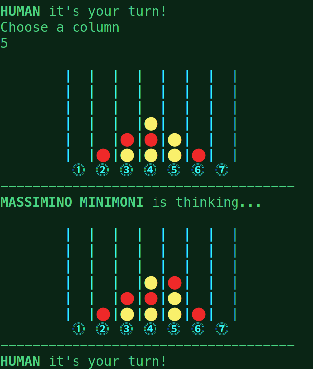

# CONNECT 4 GAME

My personal implementation for the Connect4 for the Computational Intelligence course by Prof. Squillero at Politecnico di Torino.

## Usage

```
python connect4.py
```

## About
The program features two playing modes: **Human vs Human** and **Human vs AI**.

By selecting **Human vs AI** the user gets to choose between two different AIs: **MASSIMINO MINIMONI** utilizes the Minimax Algoritm with Alpha Beta Pruning while **CARLA MONTE** uses Montecarlo Tree Search. For both the AIs the user can select the difficulty level between **easy, medium** and **hard** (**BE AWARE: choosing "hard" could increasy noticeably the execution times because it affects the max depth of the minimax algorithm and the number of simulations in the MCTS**)

In future updates the mode **AI vs AI** will be added


